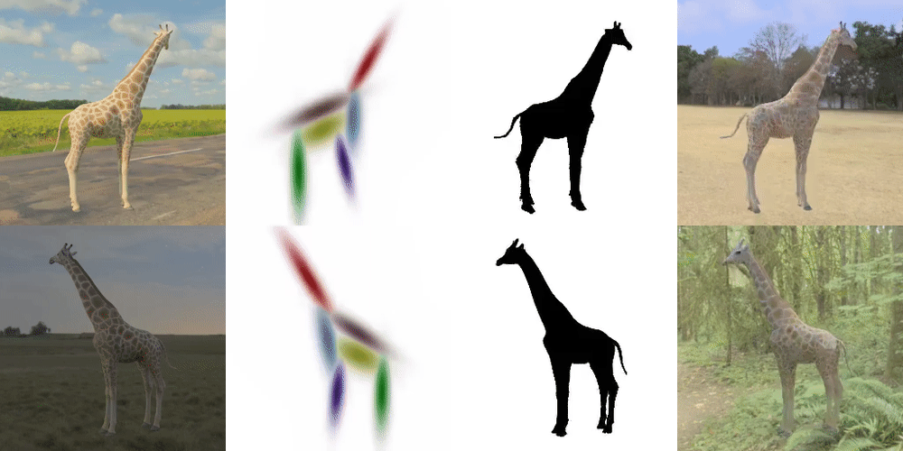

### GaussiGAN: Controllable Image Synthesis with 3D Gaussians from Unposed Silhouettes

Official implementation of the paper [GaussiGAN: Controllable Image Synthesis with 3D Gaussians from Unposed Silhouettes](https://arxiv.org/abs/2106.13215). 

Appeared in BMVC 2021 and CVPR's AI for content creation workshop. 



# Environment

```
CUDA 10
tensorflow-gpu==1.12.0
tensorpack==0.9.0
scikit-video ==1.1.11
python-opencv
dominate
```

# Datasets 

Download datasets from the [link](https://drive.google.com/drive/folders/1-ZG5zqG2Hhmfwlkia4IP2M6pSXHhTmyE?usp=sharing). 
Unzip `datasets.zip` in the project root (`gaussigan/datasets`). 

# Training 
## Mask training

To train a shape model on a dynamic object from scratch. Run the command bellow:
```
cd mask
./train_giraffe.sh
```
To train on a static object use `./mask_gen_static.py`.

## Texture training

You train a texture model on a dynamic object from scratch. First download a pretrained vgg model from [here](https://drive.google.com/drive/folders/1-ZG5zqG2Hhmfwlkia4IP2M6pSXHhTmyE?usp=sharing). 
Unzip `vgg.zip` in `gaussigan/rgb`

Start training via the command below:
```
cd rgb
./train_giraffe.sh
```
To train on a static object use `./rgb_gen_static.py`.

To load a model, add the `--load` argument followed by the path to the folder containing the corresponding checkpoints.

## Inference 
You can run mask inference via (`--modelpath` is the folder containing the frozen models):
```
cd mask
python infer_masks.py --modelpath ./train_log/gitaffe/.../20210322-214818  --ims ../datasets/rgbs/giraffe --masks ../datasets/masks/giraffe
```

You can run texture inference via:
```
cd rgb
python infer_rgbs.py --modelpath ./train_log/gitaffe/.../20210322-214818 --ims ../datasets/rgbs/giraffe --masks ../datasets/masks/giraffe
```

## Pretrained models: 

Download pretrained models from the [link](https://drive.google.com/drive/folders/1-ZG5zqG2Hhmfwlkia4IP2M6pSXHhTmyE?usp=sharing).
Unzip `pretrained.zip` in the project root, and use the models in infence mode to get results. They will be stored alongside the checkpoints. 


